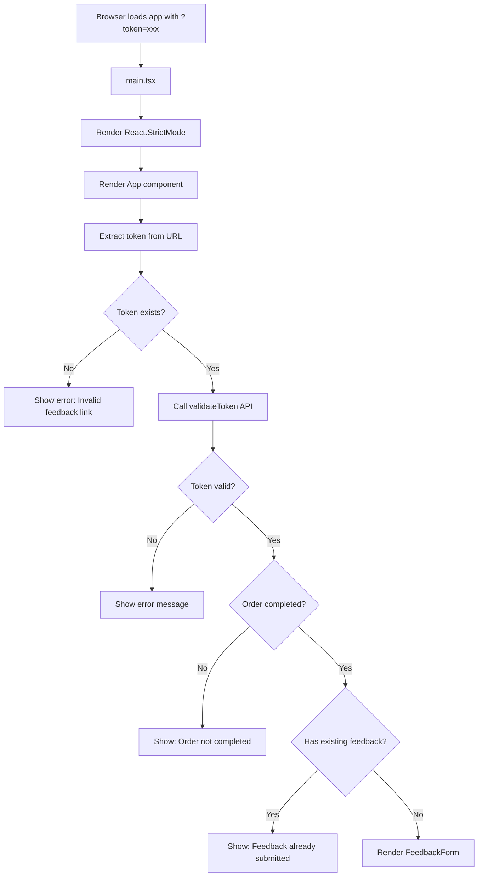
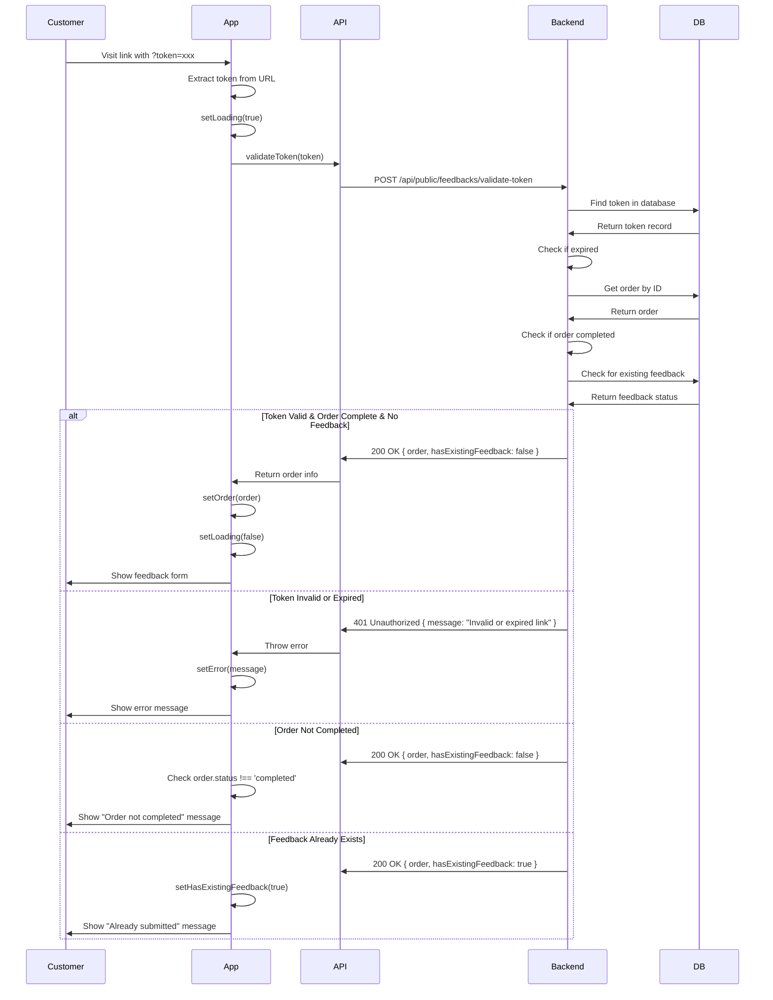
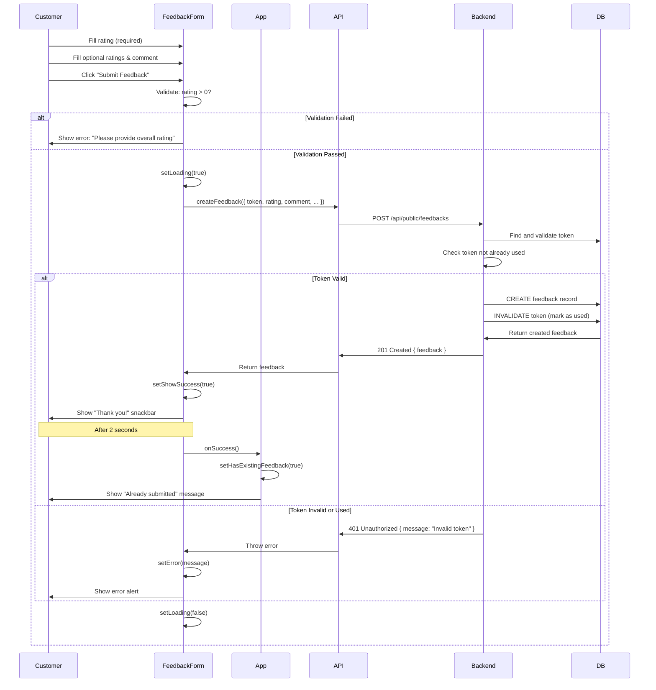
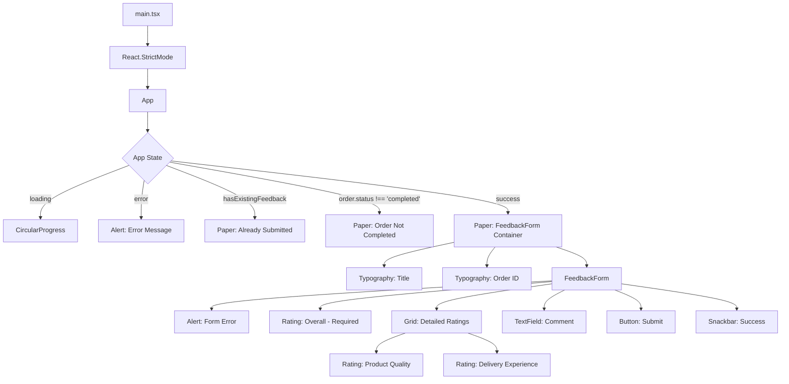
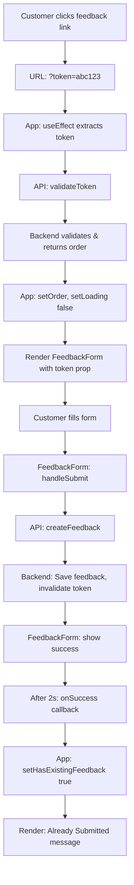

# Customer Feedback App Technical Documentation

## Table of Contents
1. [Architecture Overview](#architecture-overview)
2. [Key Components](#key-components)
3. [Feedback Submission Flow](#feedback-submission-flow)
4. [API Integration](#api-integration)
5. [Development Setup](#development-setup)
6. [Flow Diagrams](#flow-diagrams)

---

## Architecture Overview

The Customer Feedback App is a **standalone React application** designed for customers to submit feedback on their orders. It's a **public-facing, token-authenticated** app that operates independently from the main admin frontend.

### Tech Stack
- **Framework**: React 19 with TypeScript
- **Build Tool**: Vite
- **UI Library**: Material-UI (MUI) v6
- **HTTP Client**: Native Fetch API
- **Testing**: Vitest + React Testing Library
- **State Management**: Local React state (no Context needed)

### Architecture Principles
1. **Public Access**: No user authentication required
2. **Token-Based**: One-time feedback tokens generated by admin
3. **Single Purpose**: Only feedback submission (no other features)
4. **Standalone**: Separate deployment from main frontend
5. **Lightweight**: Minimal dependencies and simple state management

### Key Differences from Main Frontend
- **No Authentication**: Uses one-time tokens instead of OAuth
- **No Navigation**: Single-page form (no routing)
- **No Global State**: All state is local to App/Form components
- **Public API**: Uses `/api/public/feedbacks` endpoints
- **Customer-Facing**: Designed for end customers, not admin users

---

## Key Components

### Component Structure

```
customer-feedback-app/
├── src/
│   ├── App.tsx              # Root component, token validation
│   ├── main.tsx             # Entry point
│   ├── components/
│   │   └── FeedbackForm.tsx # Feedback form component
│   ├── services/
│   │   └── api.ts           # API client
│   ├── types/
│   │   └── index.ts         # TypeScript types
│   └── index.css            # Global styles
```

### Component Details

#### 1. **App.tsx** (Root Component)
**Responsibility**: Token validation and app state management

**Key Features**:
- Extracts token from URL query parameter (`?token=xxx`)
- Validates token with backend
- Fetches order information
- Manages loading and error states
- Handles edge cases (invalid token, already submitted, order not completed)

**States**:
```typescript
const [token, setToken] = useState<string | null>(null);
const [order, setOrder] = useState<OrderInfo | null>(null);
const [loading, setLoading] = useState<boolean>(true);
const [error, setError] = useState<string | null>(null);
const [hasExistingFeedback, setHasExistingFeedback] = useState<boolean>(false);
```

**Lifecycle**:
1. On mount: Extract token from URL
2. Validate token with backend
3. Show appropriate UI based on validation result

**UI States**:
- **Loading**: Shows spinner while validating token
- **Error**: Shows error message for invalid/expired tokens
- **Already Submitted**: Shows "thank you" message if feedback exists
- **Order Not Completed**: Shows message if order isn't complete
- **Success**: Shows feedback form for valid token

#### 2. **FeedbackForm.tsx**
**Responsibility**: Feedback submission form

**Key Features**:
- Overall rating (required, 1-5 stars)
- Product quality rating (optional, 1-5 stars)
- Delivery experience rating (optional, 1-5 stars)
- Comment text field (optional, max 1000 characters)
- Form validation (overall rating required)
- Loading state during submission
- Success notification

**States**:
```typescript
const [formData, setFormData] = useState<FeedbackFormData>({
  rating: 0,
  comment: '',
  productQuality: 0,
  deliveryExperience: 0
});
const [loading, setLoading] = useState<boolean>(false);
const [error, setError] = useState<string | null>(null);
const [showSuccess, setShowSuccess] = useState<boolean>(false);
```

**Form Validation**:
- Overall rating must be > 0 (required)
- Comment is optional but limited to 1000 characters
- Other ratings are optional

**Submission Flow**:
1. Validate form (check overall rating)
2. Call `createFeedback()` API
3. Show success message
4. After 2 seconds, call `onSuccess()` to update parent state
5. App shows "already submitted" message

#### 3. **services/api.ts**
**Responsibility**: API communication

**Functions**:

```typescript
// Validate feedback token and get order details
validateToken(token: string): Promise<TokenValidationResponse>

// Submit customer feedback (public endpoint)
createFeedback(feedback: FeedbackSubmissionData): Promise<FeedbackResponse>
```

**No Authentication**: Unlike main frontend, no bearer tokens needed (public endpoints)

---

## Feedback Submission Flow

### User Journey

```
Customer receives email with feedback link
  ↓
Click link → Opens customer-feedback-app/?token=xxx
  ↓
App validates token with backend
  ↓
If valid & order completed & no existing feedback:
  Show feedback form
  ↓
Customer fills form (rating + optional comment)
  ↓
Submit → POST /api/public/feedbacks
  ↓
Show success message
  ↓
After 2 seconds → Show "already submitted" state
```

### Token Generation (Admin Side)

Tokens are generated by admin users in the main frontend:
1. Admin views order details
2. Clicks "Generate Feedback Link"
3. Backend generates secure one-time token
4. Admin shares link with customer (e.g., via email)

### Token Validation

When customer visits the link:
1. App extracts token from URL query parameter
2. Sends token to `POST /api/public/feedbacks/validate-token`
3. Backend checks:
   - Token exists and is valid
   - Token hasn't expired
   - Order exists and is completed
   - Feedback hasn't been submitted yet
4. Returns order info or error

### Feedback Submission

When customer submits form:
1. Frontend validates: overall rating must be set
2. Sends to `POST /api/public/feedbacks` with token
3. Backend:
   - Validates token again
   - Creates feedback record in database
   - Links feedback to order
   - Invalidates token (one-time use)
4. Returns success response

---

## API Integration

### Public API Endpoints

#### 1. Validate Token
```http
POST /api/public/feedbacks/validate-token
Content-Type: application/json

{
  "token": "abc123..."
}
```

**Response (Success)**:
```json
{
  "order": {
    "_id": 123,
    "orderId": "ORD000123",
    "status": "completed"
  },
  "hasExistingFeedback": false
}
```

**Response (Error)**:
```json
{
  "message": "Invalid or expired feedback link"
}
```

#### 2. Submit Feedback
```http
POST /api/public/feedbacks
Content-Type: application/json

{
  "token": "abc123...",
  "rating": 5,
  "comment": "Great product!",
  "productQuality": 5,
  "deliveryExperience": 4
}
```

**Response (Success)**:
```json
{
  "id": 456,
  "orderId": 123,
  "rating": 5,
  "comment": "Great product!",
  "productQuality": 5,
  "deliveryExperience": 4,
  "isPublic": true,
  "createdAt": "2025-01-15T10:30:00Z"
}
```

### Error Handling

The app handles several error scenarios:
- **Invalid Token**: Shows "Invalid feedback link" message
- **Expired Token**: Shows "Invalid or expired feedback link"
- **Order Not Completed**: Shows "Order not completed yet" message
- **Feedback Already Submitted**: Shows "Feedback already submitted" message
- **Network Error**: Shows "Failed to submit feedback" message

---

## Development Setup

### Prerequisites
- Node.js 18+
- Backend API running with public feedback endpoints enabled

### Installation
```bash
cd customer-feedback-app
npm install
```

### Environment Variables
Create `customer-feedback-app/.env`:
```env
VITE_API_URL=http://localhost:5000/api
```

### Development Server
```bash
npm run dev
# Runs on http://localhost:5174 (different port from main frontend)
```

To test locally:
1. Start backend: `cd backend && npm start`
2. Start main frontend: `cd frontend && npm run dev`
3. Generate feedback token from main frontend
4. Start customer feedback app: `cd customer-feedback-app && npm run dev`
5. Open `http://localhost:5174?token=<your-token>`

### Building
```bash
npm run build
# Output: dist/
```

### Testing
```bash
# Run tests
npm test

# Coverage
npm run test:coverage
```

### Type Checking
```bash
npm run lint
# Runs TypeScript type checking
```

---

## Flow Diagrams

### Application Bootstrap Flow



### Token Validation Flow



### Feedback Submission Flow



### Component Hierarchy



### State Management Flow

```mermaid
graph LR
    A[URL ?token=xxx] --> B[App State]
    
    B --> C[token: string | null]
    B --> D[order: OrderInfo | null]
    B --> E[loading: boolean]
    B --> F[error: string | null]
    B --> G[hasExistingFeedback: boolean]
    
    H[FeedbackForm State] --> I[formData: FeedbackFormData]
    H --> J[loading: boolean]
    H --> K[error: string | null]
    H --> L[showSuccess: boolean]
    
    I --> M[rating: number]
    I --> N[comment: string]
    I --> O[productQuality: number]
    I --> P[deliveryExperience: number]
```

### Data Flow



---

## Key Features

### 1. One-Time Token System
- **Security**: Each token is single-use
- **Expiration**: Tokens can have expiration dates
- **Validation**: Token validated before form submission
- **Invalidation**: Token marked as used after feedback submitted

### 2. Validation Checks
The app performs multiple validation checks:
- **URL Token**: Token must be present in URL
- **Backend Validation**: Token must be valid and not expired
- **Order Status**: Order must be completed
- **Duplicate Check**: Feedback must not already exist
- **Form Validation**: Overall rating must be provided

### 3. User Experience
- **Simple Interface**: Clean, single-purpose form
- **Clear Messaging**: Informative error and success messages
- **Loading States**: Shows spinners during async operations
- **Responsive Design**: Works on mobile and desktop
- **Accessibility**: Proper ARIA labels and roles

### 4. Error Handling
Graceful handling of edge cases:
- Invalid/expired tokens → Clear error message
- Network errors → User-friendly error
- Already submitted → "Thank you" message
- Order not ready → Informative message

---

## Deployment

### Standalone Deployment
The customer feedback app should be deployed separately from the main frontend:

**Vercel Deployment**:
1. Create new Vercel project for `customer-feedback-app`
2. Set root directory to `customer-feedback-app`
3. Set build command: `npm run build`
4. Set output directory: `dist`
5. Add environment variable: `VITE_API_URL=<backend-url>`

**Benefits of Separate Deployment**:
- Independent scaling
- Simpler access control (public vs. authenticated)
- Different domains (e.g., `feedback.example.com`)
- Isolated updates and deployments

### URL Structure
```
https://feedback.example.com?token=<one-time-token>
```

### Integration with Main App
1. Admin generates feedback link from main frontend
2. Link includes customer feedback app URL + token
3. Admin shares link with customer (email, SMS, etc.)
4. Customer visits link and submits feedback
5. Admin views feedback in main frontend analytics

---

## Best Practices

### Security
- **One-Time Tokens**: Prevent replay attacks
- **Token Expiration**: Set reasonable expiration times
- **Public Endpoints**: No sensitive data exposure
- **Validation**: Server-side validation of all inputs

### User Experience
- **Clear Instructions**: Guide users through the process
- **Error Messages**: Friendly, actionable error messages
- **Loading States**: Show progress during async operations
- **Success Feedback**: Confirm successful submission

### Performance
- **Lightweight**: Minimal dependencies
- **Fast Load**: Small bundle size
- **Optimized Build**: Vite production build optimization

### Testing
- Write tests for:
  - Token validation logic
  - Form validation
  - Error handling
  - Success flow
  - Edge cases (already submitted, expired token, etc.)

---

## Comparison with Main Frontend

| Feature | Main Frontend | Customer Feedback App |
|---------|--------------|---------------------|
| **Purpose** | Admin dashboard | Customer feedback |
| **Authentication** | Google OAuth + JWT | One-time tokens |
| **Users** | Admin users | End customers |
| **Scope** | Full CRUD operations | Read order + submit feedback |
| **Navigation** | Multi-page (state-based) | Single page |
| **State Management** | Context API | Local state |
| **Complexity** | High (many features) | Low (single purpose) |
| **Deployment** | Private (authenticated) | Public (token-based) |

---

## Additional Resources

- [Main Frontend Documentation](./frontend.md)
- [Backend API Documentation](./backend.md)
- [Material-UI Documentation](https://mui.com/)
- [React Documentation](https://react.dev/)
- [Vite Documentation](https://vitejs.dev/)
