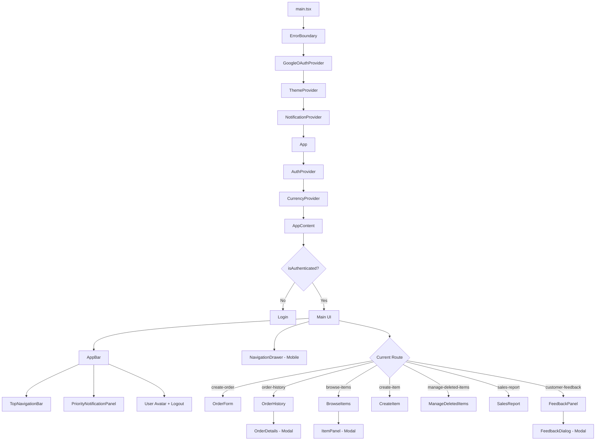

# Frontend Technical Documentation

## Table of Contents
1. [Architecture Overview](#architecture-overview)
2. [Key Components](#key-components)
3. [User Journeys](#user-journeys)
4. [API Integration](#api-integration)
5. [State Management](#state-management)
6. [Development Setup](#development-setup)
7. [Flow Diagrams](#flow-diagrams)

---

## Architecture Overview

The frontend is a **React 19** single-page application built with **Vite** and **Material-UI v6**. It follows a component-based architecture with centralized state management using React Context API.

### Tech Stack
- **Framework**: React 19 with TypeScript
- **Build Tool**: Vite (fast HMR and optimized builds)
- **UI Library**: Material-UI (MUI) v6
- **State Management**: React Context API
- **Routing**: State-based navigation (no React Router)
- **HTTP Client**: Native Fetch API with auth wrapper
- **Authentication**: Google OAuth (@react-oauth/google)
- **Testing**: Vitest + React Testing Library
- **Analytics**: Vercel Analytics + Speed Insights
- **Error Tracking**: Rollbar (optional)

### Architecture Principles
1. **Component-Based**: Modular, reusable components
2. **Context-Based State**: Global state via React Context (Auth, Currency, Notifications)
3. **Custom Hooks**: Business logic encapsulation
4. **Service Layer**: API abstraction with centralized auth
5. **Guest Mode**: View-only mode without backend calls
6. **Responsive Design**: Mobile-first with Material-UI breakpoints

---

## Key Components

### Core Application Components

#### 1. **App.tsx** (Main Container)
- **Responsibility**: Root application component and navigation controller
- **State Management**: Current route, items cache, navigation state
- **Key Features**:
  - State-based routing (no React Router for Vercel compatibility)
  - Mobile drawer navigation
  - Desktop top navigation bar
  - User authentication check
  - Priority notifications in header

#### 2. **Login.tsx**
- **Responsibility**: Authentication interface
- **Features**:
  - Google OAuth login button
  - Guest mode option (view-only)
  - Responsive design

#### 3. **ErrorBoundary.tsx**
- **Responsibility**: Global error handling
- **Features**:
  - Catch React component errors
  - Log to Rollbar (if configured)
  - Show user-friendly error message

### Feature Components

#### Order Management
- **OrderForm.tsx**: Create and edit orders with multi-item support
- **OrderHistory.tsx**: View, filter, and search past orders
- **OrderDetails.tsx**: Modal/drawer showing detailed order information
- **OrderDetailsPage.tsx**: Full-page order details view
- **PriorityNotificationPanel.tsx**: Urgent order alerts with badge

#### Item Management
- **CreateItem.tsx**: Add new items with image upload
- **BrowseItems.tsx**: View and manage inventory with pagination
- **ManageDeletedItems.tsx**: Restore or permanently delete soft-deleted items
- **ItemPanel.tsx**: Item detail modal

#### Analytics
- **SalesReport.tsx**: Sales analytics with time filters and charts
- **FeedbackPanel.tsx**: View and manage customer feedback

#### Navigation
- **TopNavigationBar.tsx**: Desktop horizontal navigation tabs
- **NavigationDrawer.tsx**: Mobile side drawer navigation

#### Common Components
- **CurrencySelector.tsx**: Multi-currency switcher
- **FeedbackDialog.tsx**: Feedback submission modal
- **common/**: Reusable UI components (buttons, cards, etc.)

### Contexts (Global State)

#### AuthContext.tsx
```typescript
interface AuthContextType {
  user: AuthUser | GuestUser | null;
  isAuthenticated: boolean;
  accessToken: string | null;
  getAccessToken: () => Promise<string | null>;
  guestMode: boolean;
  enableGuestMode: () => void;
  logout: () => void;
}
```
- **Manages**: User authentication state, Google OAuth integration
- **Features**: 
  - JWT token management
  - Session persistence (sessionStorage)
  - Guest mode toggle
  - Unauthorized callback handling

#### CurrencyContext.tsx
```typescript
interface CurrencyContextType {
  currency: Currency;
  setCurrency: (currency: Currency) => void;
  formatPrice: (amount: number) => string;
}
```
- **Manages**: Currency selection (USD, EUR, GBP, INR)
- **Features**: Price formatting with currency symbols

#### NotificationContext.tsx
```typescript
interface NotificationContextType {
  showNotification: (message: string, severity: 'success' | 'error' | 'info' | 'warning') => void;
}
```
- **Manages**: Toast notifications (Snackbar)
- **Features**: Auto-dismiss, severity levels, queue management

### Custom Hooks

The application uses custom hooks to encapsulate business logic:

| Hook | Purpose |
|------|---------|
| `useItemsData` | Fetch and manage items with pagination |
| `useDeletedItems` | Manage soft-deleted items |
| `useItemForm` | Item creation/editing form logic |
| `useImageProcessing` | Image upload and compression |
| `useOrderDetails` | Fetch and manage order details |
| `useOrderPagination` | Order list pagination |
| `useOrderFilters` | Order filtering and search |
| `usePriorityOrders` | Fetch urgent orders for notifications |
| `useSalesAnalytics` | Sales report data fetching and calculations |
| `useInfiniteScroll` | Infinite scroll implementation |
| `useUrlSync` | Sync state with URL query parameters |

### Services

#### api.ts
Central API service with:
- **Auth Integration**: Automatic token injection via `setAccessTokenGetter()`
- **Guest Mode**: Mock responses when `guestMode` is enabled
- **Error Handling**: Unauthorized callback on 401 responses
- **Endpoints**: Items, Orders, Feedback, Analytics

---

## User Journeys

### 1. Login Flow
```
User visits app → AuthContext checks session
  ├─ Has valid session → Show app
  ├─ No session → Show Login page
  │   ├─ Click "Sign in with Google" → Google OAuth → Store token → Show app
  │   └─ Click "Continue as Guest" → Enable guest mode → Show app (read-only)
  └─ Click "Sign out" → Clear session → Show Login page
```

### 2. Create Order Flow
```
Navigate to "Create Order"
  ↓
Fill customer info (name, phone, source, etc.)
  ↓
Add items (select from inventory, set quantity)
  ↓
Set delivery details (address, expected date, priority)
  ↓
Set payment details (total, advance, balance)
  ↓
Submit → POST /api/orders → Show success notification → Clear form
```

### 3. View Order History Flow
```
Navigate to "Order History"
  ↓
Fetch orders (GET /api/orders?page=1&limit=10)
  ↓
Display orders in table/cards
  ├─ Apply filters (status, date range, customer)
  ├─ Search by order ID/customer
  └─ Click order → Show OrderDetails modal
      ├─ View details
      ├─ Edit order → PUT /api/orders/:id
      └─ Duplicate order → Navigate to Create Order with prefilled data
```

### 4. Item Management Flow
```
Navigate to "Browse Items"
  ↓
Fetch items (GET /api/items?page=1&limit=20)
  ↓
Display items in grid with images
  ├─ Edit item → Update modal → PUT /api/items/:id
  ├─ Delete item → Soft delete → POST /api/items/:id (sets deletedAt)
  └─ Copy item → Navigate to Create Item with prefilled data

Navigate to "Manage Deleted Items"
  ↓
Fetch deleted items (GET /api/items/deleted)
  ↓
Display soft-deleted items
  ├─ Restore → POST /api/items/:id/restore
  └─ Permanently delete image → DELETE /api/items/:id/permanent
```

### 5. Priority Notification Flow
```
App loads → Fetch priority orders (GET /api/orders/priority)
  ↓
Display bell icon with badge count
  ↓
Click bell → Open PriorityNotificationPanel
  ↓
Show critical/high priority orders sorted by delivery date
  ├─ Click "View Order" → Navigate to Order History with order selected
  └─ Click "Refresh" → Re-fetch priority orders
```

### 6. Sales Report Flow
```
Navigate to "Sales Report"
  ↓
Select time range (today, last 7/30/90 days, custom)
  ↓
Fetch orders in range (GET /api/orders?startDate=X&endDate=Y)
  ↓
Calculate metrics:
  ├─ Total revenue, order count, average order value
  ├─ Revenue by source (Instagram, WhatsApp, Direct, etc.)
  ├─ Top customers by purchase value
  └─ Top selling items
  ↓
Display charts and tables
```

---

## API Integration

### Service Layer Architecture
The `services/api.ts` file provides a centralized API client with:

1. **Base URL Configuration**
   ```typescript
   const API_BASE_URL = import.meta.env.VITE_API_URL || 'http://localhost:5000/api';
   ```

2. **Auth Token Injection**
   ```typescript
   setAccessTokenGetter(async () => accessToken);
   setOnUnauthorizedCallback(() => logout());
   ```
   - AuthContext registers token getter on mount
   - All API calls automatically include `Authorization: Bearer <token>` header

3. **Guest Mode Support**
   ```typescript
   setGuestModeChecker(() => guestMode);
   ```
   - When guest mode is active, API calls return mock empty data
   - Prevents actual API calls to backend

### API Endpoints Used

#### Items
- `GET /api/items?page=1&limit=20` - Paginated items
- `GET /api/items/deleted?page=1&limit=20` - Soft-deleted items
- `POST /api/items` - Create item (multipart/form-data)
- `PUT /api/items/:id` - Update item
- `DELETE /api/items/:id` - Soft delete item
- `POST /api/items/:id/restore` - Restore soft-deleted item
- `DELETE /api/items/:id/permanent` - Delete image from soft-deleted item

#### Orders
- `GET /api/orders?page=1&limit=10&status=X&startDate=Y` - Paginated orders with filters
- `GET /api/orders/priority` - Urgent orders (priority ≥ 3, delivery soon)
- `POST /api/orders` - Create order
- `GET /api/orders/:id` - Get order details
- `PUT /api/orders/:id` - Update order

#### Feedback
- `GET /api/feedbacks?page=1&limit=10` - Paginated feedback
- `GET /api/feedbacks/stats` - Feedback statistics
- `POST /api/feedbacks/generate-token` - Generate feedback link
- `PUT /api/feedbacks/:id` - Update feedback

#### Public Endpoints (No Auth)
- `POST /api/public/feedbacks` - Submit customer feedback
- `POST /api/public/feedbacks/validate-token` - Validate feedback token
- `GET /api/health` - Health check

---

## State Management

### State Architecture

```
┌─────────────────────────────────────────────────────────┐
│                     App.tsx (Root)                      │
│  Local State: currentRoute, items, duplicateOrderId,    │
│               selectedOrderIdFromPriority, copiedItem    │
└─────────────────────────────────────────────────────────┘
                            │
        ┌───────────────────┴───────────────────┐
        │                                       │
┌───────▼──────────┐                  ┌────────▼─────────┐
│  AuthProvider    │                  │  NotificationProv│
│  - user          │                  │  - showNotif()   │
│  - accessToken   │                  └──────────────────┘
│  - guestMode     │
│  - login/logout  │
└───────┬──────────┘
        │
┌───────▼──────────┐
│  CurrencyProvider│
│  - currency      │
│  - formatPrice() │
└──────────────────┘
```

### State Flow
1. **Global State** (Context): Auth, Currency, Notifications
2. **App-Level State** (App.tsx): Navigation, shared data (items cache)
3. **Component State** (Local): Form data, UI state, pagination
4. **Custom Hooks**: Encapsulate data fetching and complex logic

### Navigation State Management
The app uses **state-based navigation** instead of React Router:
- `currentRoute` state tracks active page
- Navigation components (`TopNavigationBar`, `NavigationDrawer`) update `currentRoute`
- App.tsx conditionally renders components based on `currentRoute`
- Benefits: Simpler Vercel deployment, no routing configuration

---

## Development Setup

### Prerequisites
- Node.js 18+
- Backend API running on `http://localhost:5000` (or configure `VITE_API_URL`)

### Installation
```bash
cd frontend
npm install
```

### Environment Variables
Create `frontend/.env`:
```env
VITE_API_URL=http://localhost:5000/api
VITE_GOOGLE_CLIENT_ID=your-google-oauth-client-id
NEXT_PUBLIC_ROLLBAR_MYAPP_UI_CLIENT_TOKEN_1765636822=optional-rollbar-token
```

### Development Server
```bash
npm run dev
# Runs on http://localhost:5173
```

### Building
```bash
npm run build
# Output: dist/
```

### Testing
```bash
# Run tests
npm test

# Run with UI
npm run test:ui

# Coverage
npm run test:coverage
```

### Linting
```bash
npm run lint
```

### Type Checking
```bash
npm run typecheck
```

### Guest Mode (for Screenshots/Demos)
1. Start frontend: `npm run dev`
2. Navigate to `http://localhost:5173`
3. Click **"Continue as Guest (View Only)"**
4. Browse UI without backend calls (empty data)

---

## Flow Diagrams

### Application Bootstrap Flow


### Authentication Flow


### Create Order Flow


### Order History with Pagination


### Priority Notification Flow


### Item Creation with Image Upload


### Component Hierarchy



### State Management Flow


---

## Key Features

### 1. Guest Mode
- **Purpose**: View UI without authentication or API calls
- **Use Cases**: Screenshots, demos, UI testing
- **Implementation**: 
  - Click "Continue as Guest" on login page
  - `AuthContext` sets `guestMode = true`
  - `api.ts` checks guest mode and returns mock empty data
  - All API calls are intercepted

### 2. State-Based Navigation
- **Why**: Vercel compatibility, simpler than React Router
- **How**: 
  - `currentRoute` state in App.tsx
  - Navigation components update `currentRoute`
  - App.tsx conditionally renders components
- **Benefits**: No routing configuration, full control

### 3. Priority Notifications
- **Purpose**: Alert users to urgent orders
- **Criteria**: Priority ≥ 3 OR delivery within 3 days
- **UI**: Bell icon with badge count in header
- **Features**: Auto-refresh, view order details

### 4. Multi-Currency Support
- **Currencies**: USD, EUR, GBP, INR
- **Storage**: localStorage persistence
- **Formatting**: Automatic price formatting with symbols

### 5. Image Upload Optimization
- **Compression**: Browser-side compression before upload
- **Storage**: Vercel Blob Storage
- **Soft Delete**: Images retained for soft-deleted items

### 6. Responsive Design
- **Breakpoints**: xs, sm, md, lg, xl (Material-UI)
- **Mobile**: Side drawer navigation
- **Desktop**: Top navigation tabs
- **Adaptive**: Components adjust layout based on screen size

---

## Best Practices

### Component Design
- Use functional components with hooks
- Extract complex logic into custom hooks
- Keep components focused and single-responsibility
- Use TypeScript for type safety

### State Management
- Use Context for global state (Auth, Currency, Notifications)
- Use local state for component-specific data
- Use custom hooks to encapsulate data fetching
- Avoid prop drilling with Context

### API Integration
- Centralize API calls in `services/api.ts`
- Use auth token injection via `setAccessTokenGetter()`
- Handle errors consistently
- Show user-friendly notifications

### Performance
- Use pagination for large lists
- Implement infinite scroll where appropriate
- Compress images before upload
- Cache frequently accessed data (items in App.tsx)

### Testing
- Write unit tests for custom hooks
- Write integration tests for components
- Mock API calls in tests
- Use React Testing Library

---

## Additional Resources

- [Material-UI Documentation](https://mui.com/)
- [React Documentation](https://react.dev/)
- [Vite Documentation](https://vitejs.dev/)
- [Backend API Documentation](../../PROJECT_DOCUMENTATION.md#api-documentation)
